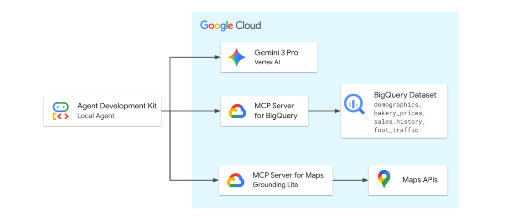

# Launch My Bakery: Google remote MCP demo 

[](https://cloud.google.com/blog/products/ai-machine-learning/announcing-official-mcp-support-for-google-services)
[](https://codelabs.developers.google.com/adk-mcp-bigquery-maps#0)
[](https://www.youtube.com/watch?v=wzccErUYhTI&t=1s)

This directory contains the data artifacts and infrastructure setup scripts for the **MCP support for BigQuery & Google Maps** demo.  

# Google-Labcode-1
# 🧠 Location Intelligence AI Agent (MCP + ADK)

A Location intelligent ADK Agent with MCP servers for BigQuery and Google Maps built using **Google Agent Development Kit (ADK)** and powered by **Gemini 3.1 Pro**, capable of analyzing business data and real-world location context using the **Model Context Protocol (MCP)**.

The agent will be equipped with tools from two remote (Google-hosted) MCP servers to securely access BigQuery for demographic, pricing, and sales data, and Google Maps for real-world location analysis and validation.

The agent orchestrates requests between the user and Google Cloud services to solve business problems related to the fictitious bakery dataset.

---

## Demo Overview

This scenario demonstrates an AI Agent's ability to orchestrate enterprise data (BigQuery) and real-world geospatial context (Google Maps) to solve a complex business problem: 

> **"How would you help a friend launch a new high-end sourdough bakery in Los Angeles?"**

The agent autonomously queries BigQuery to find macro trends and uses Google Maps to validate micro-location details. The demo relies on three key datasets:

1.  **Demographics:** To identify neighborhoods with high foot traffic using census data (Macro Discovery).
2.  **Market Data:** To analyze competitor pricing and suggest a premium price point (Pricing Strategy).
3.  **Sales History:** To forecast potential revenue based on comparable store trends (Forecasting).





The diagram above illustrates the flow of information in this demo. The Agent, powered by Gemini 3 Pro Preview, orchestrates requests between the user and Google Cloud services. It uses a remote (Google hosted) MCP server to securely access BigQuery for demographic and sales data, and Google Maps APIs for real-world location analysis and validation.

## Repository Structure

```text
launchmybakery/
├── data/                        # Pre-generated CSV files for BigQuery
│   ├── demographics.csv
│   ├── bakery_prices.csv
│   ├── sales_history_weekly.csv
│   └── foot_traffic.csv
├── adk_agent/                   # AI Agent Application (ADK)
│   └── mcp_bakery_app/          # App directory
│       ├── agent.py             # Agent definition
│       └── tools.py             # Custom tools for the agent
├── setup/                       # Infrastructure setup scripts
│   ├── setup_bigquery.sh        # Script to provision BigQuery dataset and tables
│   └── setup_env.sh             # Script to set up environment variables
├── cleanup/                     # Infrastructure clean up environment
│   ├── cleanup_env.sh           # Script to remove resources in environment
└── README.md                    # This documentation
```

## Prerequisites

*   **Google Cloud Project** with billing enabled.
*   **Google Cloud Shell** (Recommended) or a local terminal with the `gcloud` CLI installed.

## Deployment Guide

Follow these steps in **Google Cloud Shell** to provision the demo environment.

### 1. Clone the Repository
```bash
git clone https://github.com/google/mcp.git
cd mcp/examples/launchmybakery
```

### 2. Authenticate with Google Cloud

Run the following command to authenticate with your Google Cloud account. This is required for the ADK to access BigQuery.

```bash
gcloud config set project [YOUR-PROJECT-ID]
gcloud auth application-default login
```

Follow the prompts to complete the authentication process.

⚠️ Note: ADK does not automatically refresh your OAuth 2.0 token. If your chat session lasts more than 60 minutes, you may need to re-authenticate using the command above.

### 3. Configure Environment

Run the environment setup script. This script will:
*   Enable necessary Google Cloud APIs (Maps, BigQuery, remote MCP).
*   Create a restricted Google Maps Platform API Key.
*   Create a `.env` file with required environment variables.

```bash
chmod +x setup/setup_env.sh
./setup/setup_env.sh
```

### 4. Provision BigQuery

Run the setup script. This script automates the following:
*   Creates a Cloud Storage bucket.
*   Uploads the CSV data files.
*   Creates the `mcp_bakery` BigQuery dataset.
*   Loads the data into BigQuery tables.

```bash
chmod +x ./setup/setup_bigquery.sh
./setup/setup_bigquery.sh
```

### 5. Install ADK and Run Agent

Create a virtual environment, install the ADK, and run the agent.

```bash
# Create virtual environment
python3 -m venv .venv

# If the above fails, you may need to install python3-venv:
# apt update && apt install python3-venv

# Activate virtual environment
source .venv/bin/activate

# Install ADK
pip install google-adk

# Navigate to the app directory
cd adk_agent/

# Run the ADK web interface
adk web
```

### 6. Chat with the Agent

Open the link provided by `adk web` in your browser. You can now chat with the agent and ask it questions about the bakery data.

**Sample Questions:**

*   "I’m looking to open my fourth bakery location in Los Angeles. I need a neighborhood with early activity. Find the zip code with the highest 'morning' foot traffic score."
*   "Can you search for 'Bakeries' in that zip code to see if it's saturated? If there are too many, check for 'Specialty Coffee' shops, so I can position myself near them to capture foot traffic."
*    "Okay and I want to position this as a premium brand. What is the maximum price being charged for a 'Sourdough Loaf' in the LA Metro area?"
*    "Now I want a revenue projection for December 2025. Look at my sales history and take data from my best performing store for the 'Sourdough Loaf'. Run a forecast for December 2025 to estimate the quantity I'll sell. Then, calculate the projected total revenue using just under the premium price we found (let's use $18)"
*    "That'll cover my rent. Lastly, let's verify logistics. Find the closest "Restaurant Depot" to the proposed area and make sure that drive time is under 30 minutes for daily restocking."

### 7. Cleanup

To avoid incurring ongoing costs for BigQuery storage or other Google Cloud resources, you can run the cleanup script. This script will delete the BigQuery dataset, the Cloud Storage bucket, and the API keys created during setup. Navigate back to the root directory of the repository and run the following command:

```bash
chmod +x cleanup/cleanup_env.sh
./cleanup/cleanup_env.sh
```

## Data Logic & Narratives

The data in this repository is synthetic but structured to support specific demo narratives and successful agent reasoning chains.

| Table | Demo Purpose | Narrative Logic |
| :--- | :--- | :--- |
| **`foot_traffic`** | **Target Discovery**<br>Finding the target neighborhood. | **Morning** activity is uniquely spiked in **90403**, allowing the Agent to pinpoint it as the optimal location for a morning-focused business like a bakery. |
| **`demographics`** | **Community Profiling**<br>Analyzing market depth. | **Santa Monica (90403)** is modeled with a dense, established residential population, providing a stable baseline for customer volume. |
| **`bakery_prices`** | **Pricing Strategy**<br>Setting a price point. | **Erewhon Market** has the highest price ceiling for a Sourdough Loaf (~$18.50), while the market average is ~$8.20. This allows the Agent to confidently suggest a premium price point of ~$15-18. |
| **`sales_history`** | **Forecasting**<br>Predicting growth. | **Silver Lake** shows aggressive week-over-week growth trends, while **Playa Vista** represents a stable, high-volume flagship store, providing distinct patterns for forecasting models. |


# `google/mcp`

This repository contains a list of Google's official Model Context Protocol (MCP) servers, guidance on how to deploy MCP servers to Google Cloud, and examples to get started.

## ⚡ Google MCP Servers

### **Remote MCP servers** 

These [remote MCP servers are managed by Google](https://docs.cloud.google.com/mcp/overview), and are available [via endpoint](https://docs.cloud.google.com/mcp/enable-disable-mcp-servers). This list will be kept up-to-date as more remote servers become available. 

* [**AlloyDB for PostgreSQL**](https://docs.cloud.google.com/alloydb/docs/ai/use-alloydb-mcp)
* [**BigQuery**](https://docs.cloud.google.com/bigquery/docs/use-bigquery-mcp)  
* [**Bigtable**](https://docs.cloud.google.com/bigtable/docs/use-bigtable-mcp)
* [**Cloud Resource Manager**](https://docs.cloud.google.com/resource-manager/reference/mcp)
* [**Cloud SQL for MySQL**](https://docs.cloud.google.com/sql/docs/mysql/use-cloudsql-mcp)
* [**Cloud SQL for PostgreSQL**](https://docs.cloud.google.com/sql/docs/postgres/use-cloudsql-mcp)
* [**Cloud SQL for SQL Server**](https://docs.cloud.google.com/sql/docs/sqlserver/use-cloudsql-mcp)
* [**Compute Engine (GCE)**](https://docs.cloud.google.com/compute/docs/reference/mcp)
* [**Developer Knowledge API (Google Developer Documentation)**](https://developers.google.com/knowledge/mcp)
* [**Firestore**](https://docs.cloud.google.com/firestore/native/docs/use-firestore-mcp)
* [**Google Maps (Grounding Lite)**](https://developers.google.com/maps/ai/grounding-lite)  
* [**Google Security Operations (Chronicle)**](https://docs.cloud.google.com/chronicle/docs/reference/mcp)
* [**Kubernetes Engine (GKE)**](https://docs.cloud.google.com/kubernetes-engine/docs/reference/mcp)   
* [**Spanner**](https://docs.cloud.google.com/spanner/docs/use-spanner-mcp)

### **Open-source MCP servers**  

You can run these open-source MCP servers locally, or deploy them to Google Cloud (see below).  

* [**Google Workspace**](https://github.com/gemini-cli-extensions/workspace), including Google Docs, Sheets, Slides, Calendar, and Gmail. (Gemini CLI extension)  
* [**Firebase**](https://github.com/gemini-cli-extensions/firebase/) (Gemini CLI extension)  
* [**Cloud Run**](https://github.com/GoogleCloudPlatform/cloud-run-mcp) (Gemini CLI Extension)
* [**Go**](https://go.dev/gopls/features/mcp) 
* [**Google Analytics**](https://github.com/googleanalytics/google-analytics-mcp)  
* [**MCP Toolbox for Databases**](https://github.com/googleapis/genai-toolbox), including BigQuery, Cloud SQL, AlloyDB, Spanner, Firestore, and more.  
* [**Google Cloud Storage**](https://github.com/googleapis/gcloud-mcp/tree/main/packages/storage-mcp)  
* [**Genmedia**](https://github.com/GoogleCloudPlatform/vertex-ai-creative-studio/tree/main/experiments/mcp-genmedia), including Imagen and Veo models.  
* [**Kubernetes Engine (GKE)**](https://github.com/GoogleCloudPlatform/gke-mcp)  
* [**Google Cloud Security**](https://github.com/google/mcp-security), including Security Command Center, Chronicle, and more.  
* [**gcloud CLI**](https://github.com/googleapis/gcloud-mcp/tree/main/packages/gcloud-mcp)  
* [**Google Cloud Observability**](https://github.com/googleapis/gcloud-mcp/tree/main/packages/observability-mcp)
* [**Flutter/Dart**](https://github.com/dart-lang/ai/tree/main/pkgs/dart_mcp_server)
* [**Google Maps Platform Code Assist toolkit**](https://developers.google.com/maps/ai/mcp)
* [**Chrome DevTools**](https://github.com/ChromeDevTools/chrome-devtools-mcp)

## 💻 Examples

* [**Launch My Bakery**](http://github.com/google/mcp/tree/main/examples/launchmybakery) (`/examples/launchmybakery`)**:** A sample agent built with Agent Development Kit (ADK) that uses remote MCP servers for Google Maps and BigQuery. 


## 📙 Resources

### **Run an MCP server in Google Cloud** 

* [Documentation \- Host MCP Servers on Cloud Run](https://docs.cloud.google.com/run/docs/host-mcp-servers)  
* Blog Post \- [Build and Deploy a Remote MCP Server to Google Cloud Run in Under 10 Minutes](https://cloud.google.com/blog/topics/developers-practitioners/build-and-deploy-a-remote-mcp-server-to-google-cloud-run-in-under-10-minutes)  
* [MCP Toolbox for Databases \- Deploy to Cloud Run](https://googleapis.github.io/genai-toolbox/how-to/deploy_toolbox/), [Deploy to Google Kubernetes Engine (GKE)](https://googleapis.github.io/genai-toolbox/how-to/deploy_gke/)  
* [Blog post - Announcing MCP support for Apigee](https://cloud.google.com/blog/products/ai-machine-learning/mcp-support-for-apigee) (Turnkey MCP hosting for Apigee-hosted APIs)  
* “Tools Make an Agent” \- [Blog](https://cloud.google.com/blog/topics/developers-practitioners/tools-make-an-agent-from-zero-to-assistant-with-adk) and [Codelab](https://codelabs.developers.google.com/codelabs/cloud-run/tools-make-an-agent)  
* Codelab \- [How to deploy a secure MCP server on Cloud Run](https://codelabs.developers.google.com/codelabs/cloud-run/how-to-deploy-a-secure-mcp-server-on-cloud-run#0)  
* [Codelab \- "Agent Verse" \- Architecting Multi-agent Systems](http://goo.gle/summoner) 

## 🤝 Contributing

We welcome contributions to this repository, including bug reports, feature requests, documentation improvements, and code contributions. Please see our [Contributing Guidelines](https://github.com/google/mcp/blob/main/CONTRIBUTING.md) to get started.

## 📃 License

This project is licensed under the Apache 2.0 License \- see the [LICENSE](https://github.com/google/mcp/blob/main/LICENSE) file for details.

## Disclaimers

This is not an officially supported Google product. This project is intended for demonstration purposes only.

This project is not eligible for the [Google Open Source Software Vulnerability Rewards Program](https://bughunters.google.com/open-source-security). 

